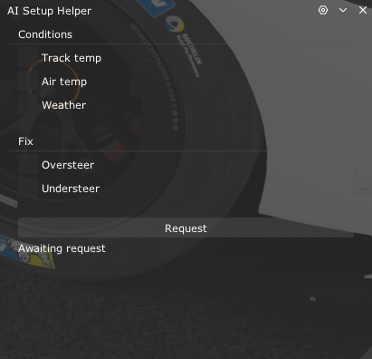
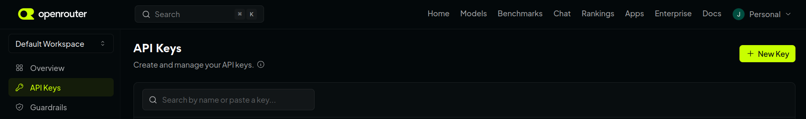
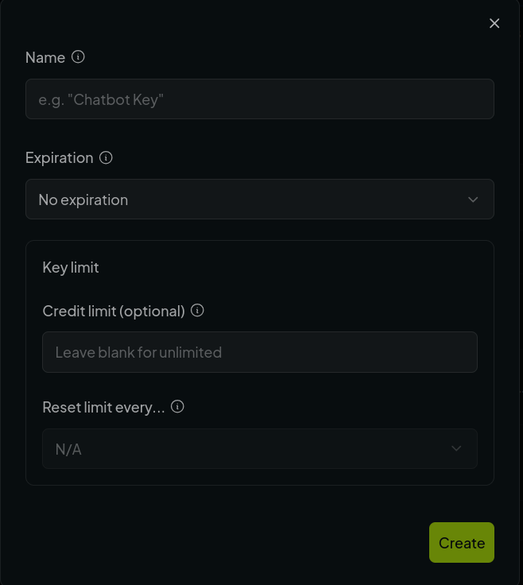
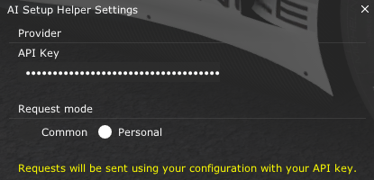

# AI-Setup-Helper-AC

An Assetto Corsa Lua app to use AI to generate setups for you

Very important to note before anything, this is not a replacement for a brain. The goal is not to use the app blindly
and trust AI slop setups, while your brain goes smooth. 

It was made for people who have no idea in which direction to go when starting a setup.

The idea for the app is to get that direction from the AI, but still, most likely you will still need to 
fine-tune the setup to make
it good, but by this point you should only need to tweak some fields (even if you have no clue what, read the 
descriptions for the fields in the game).

#### Quick links:

- [Usage](#usage)
- [Modes](#modes)
- [**Set Up Personal Mode**](#set-up-personal-mode) - recommended if you do not want to be dependent of the shared app




Icon maker

<a href="https://www.flaticon.com/free-icons/repair" title="repair icons">Repair icons created by Eucalyp - Flaticon</a>

Also, if you really like this app, you can support it :)
https://ko-fi.com/jcsilva

My other mod:
https://www.overtake.gg/downloads/battery-helper.85815/

## Usage

Click on the 'Request' button to get the setup. If you wish to include the fields available, click on the boxes.
The current values are the default, some have sliders for you to choose custom values.

There are also options to indicate the AI to try and fix oversteer or understeer.

The small text box below the 'Request' button, informs you of the current state

- if yellow, the request is pending and being processed
- if green, the request was received and applied successfully
- red means something wrong. The message
may indicate what (if it is not something to solve on your end, it may be more generic).

Some errors include:

- *Rate limit exceeded* → you sent too many request in a short span of time, wait briefly until it resets
- *Unauthorized* → something in the configuration is wrong and either the common app (explained below) or the provider
are blocking the usage
- *Chosen provider is down* → the AI provider is down so no AI setups
- *Ran out of credits* → no more money on the AI provider
- *Body size too large* → means that somehow (it should only happen to funny people trying to exploit the shared app)
the contents send, are much bigger than they should
- *Invalid (something) from provider* → most likely the AI hallucinated and returned garbage

## Modes

There are 2 modes to use the app

### Common

This is the default mode. All requests go to a shared app.

#### Pros

- No configurations needed
- No money involved
- Some setups may be cached, so it can be faster

#### Cons

- The app is hosted on a free tier of a provider, which means sometimes it shuts off.
The first request can take longer while it is booting up.
- If people try to abuse it, I will shut it down
- There are rate limits, so you make to many requests in a short period of time, you may be temporarily blocked.
- You are dependent of me keeping up with the AI provider costs, and I am not Santa Claus, if they start asking me too
much (or better anything at all), and there are no donations, I will turn it off also :)
- Sometime in the future (if there is no money on the provider) I may switch to a free model, which means very few
requests per day and limited reasoning

### Personal

This is the other one, it requires *some* configuration (creating an account and copy-pasting some text :| )

#### Pros

- You are only depend on the AI provider and not me and my shared app
- May be faster (fewer requests made)
- You can customise it better, you can change the prompt or the models in the `requests.lua` file

#### Cons

- Requires some configuration (not much, but more than there should be for an Assetto Corsa mod)
- If you use it too much, the provider may start asking you for money (some don't ask for low usage)
- If you screw up any configuration or any changes you make, that's on you.

## Set Up Personal Mode

For the AI provider, I use OpenRouter, it has worked well for other projects, has a lot of models available and I've
been able to use it without using too many credits.

You can use another one (these instructions will be for OpenRouter), there are some compatible with the app
(OpenAI, for example), currently,
but if you choose another you may need to make some changes in the requests.

### Create an account

Well, you have to create an account here: https://openrouter.ai/

When you have an account go to this page: https://openrouter.ai/workspaces/default/keys

In here you can click the 'New Key' button (on the right) to create the key for the app.


Choose a name like 'AI-Setup-Helper', or whatever as long as you can identify what it is,
choose an expiration for the key (you can just leave it with no expiration, as long as you don't share the key),
and you can also leave a limit (in USD) for the key that resets periodically (this you can put like 1 or 10 dollars each
month, year, whatever, it is good practice in case someone else gets access to it).



Before the next step, two very important details.

- Do not share the key, very bad idea
- Make sure to copy it as soon as you create it, they will not let you see it again

With this in mind, create the key and make sure to, temporarily store it wherever to then put it in-game.

Inside Assetto Corsa, go to the setup menu, with the app open, click on the gear icon on the top right of the window,
and paste the key into the field.


Also make sure the 'Personal' mode is selected.

It should look something like this:



### Using Free Models

OpenRouter allows small negative balances, so you can test paid models initially before switching. If you prefer to use zero-cost models, update your configuration:

1. Open the app folder (typically `assettocorsa/apps/lua/AI-Setup-Helper-AC`).
2. Open `requests.lua` in any text editor
3. Search for `local model =` and update the line to:
   ```lua
   local model = "openrouter/free"
   ```

With this you can now use the app with your own key, making you less dependent of my shared app.
